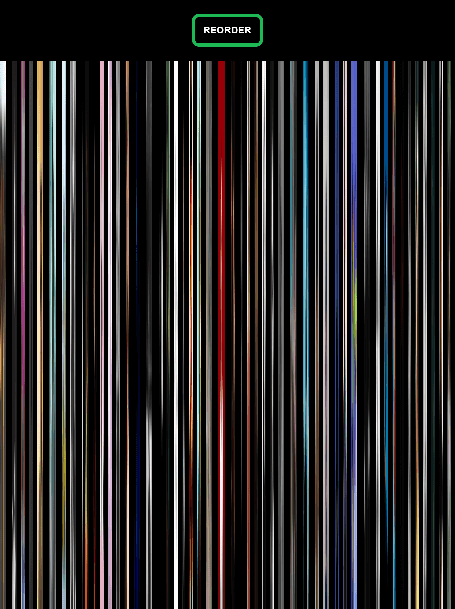

# Collager



Made with React utilising the Spotify Web API.

Create a barcode collage from your favourite spotify artist's profile pictures.

## Setup

Clone the project:

```
git clone https://github.com/ianbaxter/Collager
```

Navigate to the project directory:

```
cd Collager
```

Install dependencies:

```
npm install
```

Start the development server:

```
npm start
```

Go to http://localhost:3000/ to view the application.

## Deploy

To deploy your own version of this app, create an .env file and add your spotify api client ID and redirect URL.

```
REACT_APP_CLIENT_ID=your_client_id
REACT_APP_REDIRECT_URI=your_rdirect_url
```

To deploy to GitHub Pages first install gh-pages:

```
npm install gh-pages
```

Next in package.json add:

```
"homepage": "link-to-your-repository"
```

Also in package.json add:

```
{
   ...
   "predeploy": "yarn run build",
   "deploy": "gh-pages -d build",
   ...
}
```

Finally to deploy the app run the following command:

```
npm run deploy
```

## License

This project is licensed under the MIT License - see the LICENSE file for details
